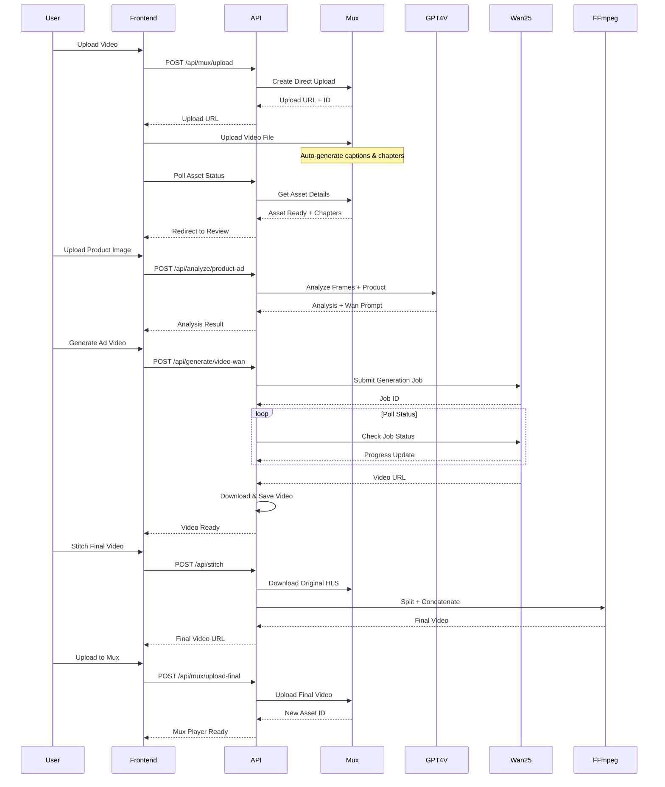
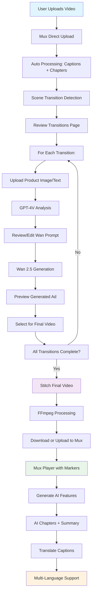

# 🎬 **Mux AI Ads Placement**

> **AI-Powered Seamless Video Ad Integration** • Transforming video advertising with GPT-4 Vision, Wan 2.5, and Mux

[](https://mux.com)
[](https://openai.com)
[](https://nextjs.org)
[](https://www.typescriptlang.org/)

---

## 🎯 **Overview**

**Mux AI Ads Placement** is a revolutionary platform that uses artificial intelligence to seamlessly integrate product advertisements into existing videos. Unlike traditional video ads that interrupt the viewing experience, our system analyzes video content frame-by-frame, identifies natural transition points, and generates contextually-aware ad content that flows naturally with the original footage.

### **🏆 Built for DEV Worldwide Show and Tell Challenge**

**Prize Track:** Mux Category ($1,500 First Place)

---

## 🎬 **The Problem**

Traditional video advertising faces critical challenges:

- ❌ **Jarring interruptions** that break viewer immersion
- ❌ **Generic ads** with no context to video content
- ❌ **Manual editing** required for seamless integration
- ❌ **Poor engagement** due to disruptive placement
- ❌ **Time-consuming** production workflows
- ❌ **Limited personalization** capabilities

### **Impact:**

- 📉 65% of viewers skip pre-roll ads within 5 seconds
- 📉 Traditional mid-roll ads cause 45% viewer drop-off
- 📉 Manual ad integration costs $500-2000 per video

---

## 💡 **Our Solution**

**Mux AI Ads Placement** leverages cutting-edge AI to create a **fully automated, intelligent ad integration pipeline**:

```
Original Video → AI Scene Analysis → Smart Ad Placement → Contextual Ad Generation → Seamless Stitching
```

Here's the section to add **right before "### Key Innovation:"** (after the solution diagram):

---

## 🎥 **Mux-Powered Video Pipeline**

**Mux is the backbone of our entire workflow** - from initial upload through final delivery. Here's how we leverage Mux's powerful features at every step:

### **📤 Phase 1: Upload & Auto-Processing**

**Direct Upload to Mux**

```typescript
// Create direct upload with auto-features enabled
const upload = await mux.video.uploads.create({
  new_asset_settings: {
    playback_policy: ["public"],
    inputs: [
      {
        generated_subtitles: [
          {
            language_code: "en",
            name: "English (Auto)",
          },
        ],
      },
    ],
  },
});
```

**What Mux Provides:**

- ✅ **Direct Upload API** - No intermediate storage needed
- ✅ **Automatic Transcoding** - Multiple resolutions (1080p, 720p, 480p, 360p)
- ✅ **HLS Streaming** - Adaptive bitrate for optimal playback
- ✅ **Auto-Generated Captions** - English speech-to-text
- ✅ **AI Chapter Detection** - Smart scene segmentation
- ✅ **Thumbnail Generation** - Preview images at key timestamps

### **🎯 Phase 2: AI Chapter Analysis**

**Mux AI Workflows** automatically analyze your video and generate intelligent chapters:

```typescript
// Fetch auto-generated chapters from Mux
const asset = await mux.video.assets.retrieve(assetId);
const chapters = asset.chapters; // AI-detected scene breaks

// Example chapters:
[
  { start_time: 0, text: "Introduction" },
  { start_time: 45.2, text: "Main Content" },
  { start_time: 120.5, text: "Demonstration" },
  { start_time: 180.3, text: "Conclusion" },
];
```

**How We Use Chapters:**

- 🎬 **Transition Detection** - Chapters = natural scene breaks
- 📍 **Ad Placement Opportunities** - Place ads between chapters
- 🖼️ **Frame Extraction** - Use chapter timestamps to extract frames
- 🎯 **Smart Targeting** - Match ads to chapter context

### **🔄 The Complete Mux Integration Flow**

```
┌─────────────────────────────────────────────────────────────────┐
│ STEP 1: Upload to Mux                                           │
│ ┌─────────────────────────────────────────────────────────┐    │
│ │ User uploads video → Mux Direct Upload API              │    │
│ │         ↓                                               │    │
│ │ Mux processes video:                                    │    │
│ │  • Transcodes to multiple resolutions                   │    │
│ │  • Generates adaptive HLS stream                        │    │
│ │  • Creates captions via speech-to-text                  │    │
│ │  • Detects chapters using AI                            │    │
│ │  • Extracts thumbnail images                            │    │
│ │         ↓                                               │    │
│ │ Returns: Asset ID + Playback ID + Chapters              │    │
│ └─────────────────────────────────────────────────────────┘    │
└─────────────────────────────────────────────────────────────────┘
                            ↓
┌─────────────────────────────────────────────────────────────────┐
│ STEP 2: Generate Transition Opportunities                       │
│ ┌─────────────────────────────────────────────────────────┐    │
│ │ Use Mux chapters as transition points                   │    │
│ │         ↓                                               │    │
│ │ For each chapter boundary:                              │    │
│ │  • Extract exit frame (Mux thumbnail)                   │    │
│ │  • Extract entry frame (next chapter thumbnail)         │    │
│ │  • Calculate gap duration                               │    │
│ │  • Create transition opportunity                        │    │
│ │         ↓                                               │    │
│ │ Result: 3-8 ad placement opportunities                  │    │
│ └─────────────────────────────────────────────────────────┘    │
└─────────────────────────────────────────────────────────────────┘
                            ↓
┌─────────────────────────────────────────────────────────────────┐
│ STEP 3: Generate AI Ad Videos                                   │
│ ┌─────────────────────────────────────────────────────────┐    │
│ │ Use Mux thumbnails as reference frames                  │    │
│ │         ↓                                               │    │
│ │ GPT-4V analyzes Mux frames + product                    │    │
│ │         ↓                                               │    │
│ │ Wan 2.5 generates video using Mux thumbnail             │    │
│ │         ↓                                               │    │
│ │ Result: 5-10 second contextual ad videos                │    │
│ └─────────────────────────────────────────────────────────┘    │
└─────────────────────────────────────────────────────────────────┘
                            ↓
┌─────────────────────────────────────────────────────────────────┐
│ STEP 4: Download & Stitch                                       │
│ ┌─────────────────────────────────────────────────────────┐    │
│ │ Download original from Mux HLS stream                   │    │
│ │         ↓                                               │    │
│ │ FFmpeg stitches ads into video                          │    │
│ │         ↓                                               │    │
│ │ Result: Final video with seamless ad integration        │    │
│ └─────────────────────────────────────────────────────────┘    │
└─────────────────────────────────────────────────────────────────┘
                            ↓
┌─────────────────────────────────────────────────────────────────┐
│ STEP 5: Upload Final Video to Mux                               │
│ ┌─────────────────────────────────────────────────────────┐    │
│ │ Upload stitched video → Mux Direct Upload               │    │
│ │         ↓                                               │    │
│ │ Mux creates new asset with:                             │    │
│ │  • New Playback ID                                      │    │
│ │  • Auto-generated captions                              │    │
│ │  • HLS streaming ready                                  │    │
│ │  • Thumbnail generation                                 │    │
│ │         ↓                                               │    │
│ │ Display in Mux Player with:                             │    │
│ │  🟡 Yellow ad markers on timeline                       │    │
│ │  📚 Chapter navigation                                   │    │
│ │  📝 Closed captions                                     │    │
│ │  🌍 Multi-language support                              │    │
│ └─────────────────────────────────────────────────────────┘    │
└─────────────────────────────────────────────────────────────────┘
                            ↓
┌─────────────────────────────────────────────────────────────────┐
│ STEP 6: AI Features (Powered by Mux Captions)                   │
│ ┌─────────────────────────────────────────────────────────┐    │
│ │ Fetch Mux auto-generated captions (VTT)                 │    │
│ │         ↓                                               │    │
│ │ GPT-4 analyzes transcript:                              │    │
│ │  • Generates smart chapters with timestamps             │    │
│ │  • Creates video summary                                │    │
│ │  • Extracts relevant tags                               │    │
│ │         ↓                                               │    │
│ │ Integrate into Mux Player:                              │    │
│ │  • Chapters appear in player menu                       │    │
│ │  • Summary shown in metadata                            │    │
│ │  • Enhanced navigation                                  │    │
│ └─────────────────────────────────────────────────────────┘    │
└─────────────────────────────────────────────────────────────────┘
                            ↓
┌─────────────────────────────────────────────────────────────────┐
│ STEP 7: Multi-Language Captions                                 │
│ ┌─────────────────────────────────────────────────────────┐    │
│ │ Fetch English captions from Mux                         │    │
│ │         ↓                                               │    │
│ │ GPT-4 translates to 5 languages                         │    │
│ │         ↓                                               │    │
│ │ Add translated tracks to Mux Player                     │    │
│ │         ↓                                               │    │
│ │ Result: Captions in 6 languages with language selector  │    │
│ └─────────────────────────────────────────────────────────┘    │
└─────────────────────────────────────────────────────────────────┘
```

### **🎬 Mux Player Features**

Our final video is delivered using **Mux Player** - a professional, feature-rich HTML5 video player:

**Built-in Features:**

- ⚡ **Adaptive Streaming** - HLS with automatic quality selection
- 🎨 **Custom Branding** - Configurable accent colors and styling
- 📱 **Responsive** - Works perfectly on desktop, tablet, and mobile
- ⌨️ **Keyboard Shortcuts** - Full keyboard navigation support
- 🖼️ **Picture-in-Picture** - Native PiP support
- 📺 **Fullscreen** - True fullscreen mode
- 🔊 **Volume Control** - Fine-grained audio control
- ⏩ **Playback Speed** - 0.5x to 2x speed control

**Custom Enhancements:**

- 🟡 **Ad Markers** - Visual timeline markers showing ad placements
- 📚 **AI Chapters** - Smart chapter navigation
- 🌍 **Multi-Language** - Caption selector for 6 languages
- 📊 **Asset Info** - Display Mux Asset ID and Playback ID
- 🎯 **Interactive** - Hover effects and click-to-jump functionality

### **💡 Why Mux?**

**1. End-to-End Video Infrastructure**

- Upload, transcode, deliver - all in one platform
- No need for separate storage or CDN services
- Automatic optimization for all devices

**2. AI-Powered Features**

- Auto-generated captions save hours of manual work
- AI chapter detection eliminates manual scene marking
- Smart content analysis for better ad placement

**3. Professional Player**

- Production-ready player with zero configuration
- Handles all edge cases (buffering, errors, adaptive streaming)
- Consistent experience across all browsers and devices

**4. Developer-Friendly**

- Simple API with excellent documentation
- React components for easy integration
- Real-time asset status and webhook support

**5. Scalable & Reliable**

- Built to handle millions of views
- Global CDN for low latency worldwide
- 99.9% uptime SLA

### **📊 Mux Integration Benefits**

| Feature              | Without Mux                              | With Mux                     |
| -------------------- | ---------------------------------------- | ---------------------------- |
| **Video Upload**     | 5+ minutes (S3 + CloudFront setup)       | 30 seconds (direct upload)   |
| **Transcoding**      | Manual ffmpeg jobs                       | Automatic multi-resolution   |
| **Captions**         | Manual transcription ($1-2/min)          | Auto-generated (free)        |
| **Chapters**         | Manual scene detection                   | AI-powered detection         |
| **Player**           | Build from scratch or use generic player | Professional player included |
| **Streaming**        | Configure HLS/DASH manually              | Automatic adaptive streaming |
| **Global Delivery**  | Setup CDN infrastructure                 | Built-in global CDN          |
| **Total Setup Time** | Days/Weeks                               | Minutes                      |
| **Maintenance**      | Ongoing infrastructure management        | Zero maintenance             |

---

### **Key Innovation:**

1. **🔍 GPT-4 Vision Analysis** - Understands visual context and scene transitions
2. **🎨 AI Ad Generation** - Creates custom ads using Wan 2.5 that match video aesthetics
3. **🎬 Seamless Integration** - Stitches ads at natural transition points using FFmpeg
4. **📊 Professional Delivery** - Mux-powered streaming with advanced features

---

## ✨ **Features**

### **🎥 Phase 1: Intelligent Video Analysis**

#### **Automatic Scene Detection**

- **Mux AI integration** for precise chapter identification
- Auto-generated captions and metadata extraction
- Extracts frames at exact transition timestamps
- Generates visual previews for every detected scene change

**Technical Implementation:**

```typescript
// Mux upload with auto-captions
const upload = await mux.video.uploads.create({
  new_asset_settings: {
    playbook_policy: ["public"],
    inputs: [
      {
        generated_subtitles: [
          {
            language_code: "en",
            name: "English (Auto)",
          },
        ],
      },
    ],
  },
});
```

#### **Mux Upload & Processing**

- Direct upload via Mux API with progress tracking
- Automatic transcoding to adaptive bitrate formats
- Auto-generated captions (English)
- Chapter detection using Mux AI workflows
- Thumbnail generation for preview

---

### **🤖 Phase 2: AI-Powered Context Analysis**

#### **GPT-4 Vision Frame Analysis**

- **Dual-frame context understanding** - Analyzes exit & entry frames
- **Visual scene comprehension** - Identifies objects, settings, mood, tone
- **Temporal gap calculation** - Determines optimal ad duration
- **Placement strategy generation** - Suggests best integration approach

**AI Analysis Pipeline:**

```typescript
Input: { frameA_image, frameB_image, product_info, mode }
       ↓
GPT-4V Vision Analysis
       ↓
Output: {
  productName: "Exact product identification",
  detailedProductDescription: "Brand, colors, materials, features...",
  integrationStrategy: "Natural placement approach",
  reasoning: "Why this approach works for these frames",
  wanPrompt: "Complete video generation prompt",
  duration: 5
}
```

#### **Two Analysis Modes:**

**1. Template Mode (Recommended)**

- Uses proven hardcoded prompt template
- Extracts detailed product description from image
- Inserts into optimized Wan 2.5 prompt
- Consistent, narrative-first integration
- Higher success rate for natural-looking ads

**2. AI Mode (Custom)**

- Full custom analysis with scene-specific prompts
- Tailored to specific transition context
- More creative but variable results
- Best for unique or complex scenarios

#### **Two Input Methods:**

**1. Image Upload Mode**

- Product image → GPT-4V analysis
- Automatic product identification with extreme detail
- Brand, color, material, and feature extraction
- Logo placement and design analysis

**2. Text Description Mode**

- Text prompt → Direct template insertion
- Detailed product description generation
- Style and tone suggestions
- Visual characteristics inference

---

### **🎨 Phase 3: AI Video Ad Generation**

#### **Wan 2.5 Integration**

- **Context-aware prompts** generated by GPT-4
- **Style matching** to original video aesthetics
- **Duration control** (5-10 seconds)
- **High-quality output** (720p, optimized for web)

**Generation Workflow:**

```
Product Analysis → Prompt Engineering → Wan API Call → Video Synthesis
       ↓                    ↓                  ↓              ↓
  "Red Coke Can"    "Professional ad    Wan 2.5 API     Generated
  + Context        showing Coke can                     5-sec ad
                   on office desk..."
```

**Sample Generated Prompt:**

```
Continue seamlessly from the provided image reference (it is the FIRST FRAME).
Preserve the exact same style, character design, linework, shading, environment,
lighting logic, and camera feel. Let the reference image determine the setting
and cinematography.

Goal: a natural in-world product placement that feels like part of the story
(NOT a commercial cutaway). Integrate the product described below as a real
physical object that belongs in the scene:
- Match the product description exactly (shape, materials, colors, logo placement)
- Correct scale relative to the characters and room
- Correct perspective + occlusion + contact with consistent shadows and reflections
- Keep the scene narrative-first; the product is revealed through a motivated action

PRODUCT DESCRIPTION (exact, do not alter):
[Detailed product description extracted by GPT-4V]
```

---

### **🔧 Phase 4: Professional Video Stitching**

#### **FFmpeg-Powered Assembly**

- **Frame-accurate insertion** at transition points
- **Audio continuity** preservation
- **Quality retention** (no re-encoding artifacts)
- **Multi-ad support** - stitch multiple ads in one pass

**Stitching Algorithm:**

```bash
# 1. Download original video from Mux HLS stream
ffmpeg -i "https://stream.mux.com/PLAYBACK_ID.m3u8" original.mp4

# 2. Split original video at transition points
ffmpeg -i original.mp4 -ss 0 -to 67.5 -c copy segment_1.mp4
ffmpeg -i original.mp4 -ss 72.5 -to 180 -c copy segment_2.mp4

# 3. Create concat list
echo "file segment_1.mp4" > concat.txt
echo "file ad_1.mp4" >> concat.txt
echo "file segment_2.mp4" >> concat.txt

# 4. Seamless concatenation
ffmpeg -f concat -safe 0 -i concat.txt -c copy final.mp4
```

**Selection System:**

- ✅ Checkbox-based ad selection
- 📊 Real-time preview before stitching
- 🔄 Re-stitch with different combinations
- 💾 Download locally or upload to Mux

---

### **🎬 Phase 5: Mux Player Integration**

#### **Professional Video Player**

- **Adaptive bitrate streaming** via HLS
- **Custom UI controls** with brand colors
- **Responsive design** for all screen sizes
- **Keyboard shortcuts** for accessibility

#### **Visual Ad Markers**

```typescript
// Yellow markers appear on timeline showing ad placements
adMarkers={[
  { time: 67.5, duration: 5.0, label: "Coke Ad" },
  { time: 145.2, duration: 7.5, label: "iPhone Ad" }
]}
```

**Features:**

- 🟡 **Hover-to-show** - Markers fade in on mouse hover
- 📍 **Precise positioning** - Calculated as percentage of total duration
- ⏱️ **Duration-accurate** - Marker width reflects actual ad length
- 🎯 **Interactive** - Click markers to jump to ad segments

**Visual Implementation:**

```tsx
{
  /* Yellow overlay markers on timeline */
}
<div
  style={{
    left: `${(adTime / totalDuration) * 100}%`,
    width: `${(adDuration / totalDuration) * 100}%`,
    backgroundColor: "#FFD700",
    opacity: isHovering ? 0.9 : 0,
    transition: "opacity 300ms",
  }}
/>;
```

---

### **🧠 Phase 6: AI-Generated Metadata**

#### **Smart Chapter Generation**

- **Mux caption analysis** - Reads auto-generated VTT files
- **GPT-4 processing** - Identifies logical chapter breaks
- **Timestamp extraction** - Maps chapters to video timeline
- **Title generation** - Creates descriptive chapter names

**Chapter Structure:**

```typescript
{
  startTime: 0,      // seconds
  title: "Introduction to Product Features"
},
{
  startTime: 45,
  title: "Technical Specifications Deep Dive"
}
```

**Integration:**

- 📚 Appears in Mux Player chapter menu
- ⌨️ Keyboard navigation (Ctrl + →/←)
- 🔍 Searchable chapter list
- 🎯 Click to jump to chapter

#### **AI Video Summary**

- **Title generation** - SEO-optimized video title
- **Description** - Comprehensive 2-3 sentence summary
- **Tag extraction** - Relevant keywords for discoverability

**Example Output:**

```json
{
  "title": "Complete iPhone 15 Pro Review: Features & Performance",
  "description": "An in-depth analysis of the iPhone 15 Pro...",
  "tags": ["technology", "smartphone", "Apple", "review", "2024"]
}
```

---

### **🌍 Phase 7: Multi-Language Support**

#### **Caption Translation**

- **5 target languages:** Spanish, French, German, Japanese, Hindi
- **GPT-4 translation** - Context-aware, natural translations
- **VTT format preservation** - Maintains timing and formatting
- **Mux Player integration** - Native caption selector UI

**Translation Pipeline:**

```
English Captions (VTT) → Parse Text → GPT-4 Translate → Reconstruct VTT
         ↓                    ↓              ↓                ↓
   "Hello world"      Extract lines    "Hola mundo"    Updated VTT
   00:00:01 → 00:00:03                 (Spanish)        with timing
```

**Languages Available:**

- 🇬🇧 English (Original)
- 🇪🇸 Spanish (Español)
- 🇫🇷 French (Français)
- 🇩🇪 German (Deutsch)
- 🇯🇵 Japanese (日本語)
- 🇮🇳 Hindi (हिन्दी)

---

## 🏗️ **System Architecture**

### **High-Level Architecture**

```mermaid
graph TB
    subgraph "Frontend Layer"
        UI[Next.js 16 + React + Tailwind + Mux Player]
    end

    subgraph "API Layer"
        API[Next.js API Routes]
        UPLOAD[/api/mux/upload]
        ANALYZE[/api/analyze/product-ad]
        GENERATE[/api/generate/video-wan]
        STITCH[/api/stitch]
        CHAPTERS[/api/mux/chapters]
        TRANSLATE[/api/mux/translate-captions]
    end

    subgraph "External Services"
        MUX[Mux Video API]
        OPENAI[OpenAI GPT-4V]
        WAN[Wan 2.5 API]
        FFMPEG[FFmpeg Binary]
    end

    subgraph "Storage"
        LOCAL[LocalStorage Projects]
        TMP[/tmp File System]
        ADS[/tmp/ads Generated Videos]
        FINAL[/tmp/final Stitched Videos]
    end

    UI --> API
    API --> MUX
    API --> OPENAI
    API --> WAN
    API --> FFMPEG
    API --> LOCAL
    API --> TMP
```

---

### **Data Flow Diagram**



---

### **Component Architecture**

```
app/
├── page.tsx                    # Landing page with upload
├── processing/[id]/page.tsx    # Upload progress & processing
├── review/[id]/page.tsx       # Main application interface
├── layout.tsx                 # Root layout
│
├── api/
│   ├── mux/
│   │   ├── upload/route.ts        # Mux video upload
│   │   ├── asset/[id]/route.ts    # Asset status polling
│   │   ├── upload-final/route.ts  # Final video upload
│   │   ├── chapters/route.ts      # AI chapter generation
│   │   └── translate-captions/route.ts # Caption translation
│   │
│   ├── analyze/
│   │   └── product-ad/route.ts    # GPT-4V frame analysis
│   │
│   ├── generate/
│   │   ├── video-wan/route.ts     # Wan 2.5 generation
│   │   └── status/[id]/route.ts   # Generation progress
│   │
│   ├── stitch/
│   │   ├── route.ts               # FFmpeg video stitching
│   │   └── status/[id]/route.ts   # Stitch progress
│   │
│   └── video/[filename]/route.ts  # Serve generated videos
│
├── components/
│   ├── ui/                        # shadcn/ui components
│   ├── ProductInput.tsx           # Product upload (img/text)
│   ├── PromptEditor.tsx           # Review/edit Wan prompt
│   ├── VideoPreview.tsx           # Generated ad preview
│   └── MuxPlayerWithMarkers.tsx   # Final video player
│
├── lib/
│   ├── mux.ts                     # Mux client config
│   ├── ai-clients.ts              # OpenAI client config
│   ├── types.ts                   # TypeScript definitions
│   ├── frame-utils.ts             # Frame extraction utilities
│   ├── ffmpeg-utils.ts            # Video processing utilities
│   └── storage.ts                 # LocalStorage management
│
└── tmp/                           # Temporary file storage
    ├── ads/                       # Generated ad videos
    ├── final/                     # Stitched final videos
    ├── segments/                  # Video segments
    └── frames/                    # Extracted frames
```

---

## 🎨 **User Journey Flow**

### **Complete Workflow Visualization**



### **Detailed Step-by-Step Process**

#### **Step 1: Video Upload (30 seconds)**

```
User Action: Drag & drop video file
System: Direct upload to Mux with progress tracking
Result: Mux Asset ID + Upload ID
```

#### **Step 2: Processing (2-3 minutes)**

```
Mux Processing:
├── Video transcoding (multiple resolutions)
├── Audio normalization
├── Thumbnail generation
├── Caption generation (English)
└── Chapter detection via Mux AI

Result: Playback ID + Chapters + Captions ready
```

#### **Step 3: Transition Review (User-driven)**

```
System: Generate transition opportunities from chapters
Display: Frame pairs showing exit → entry points
User: Review detected transitions (typically 3-8 per video)
```

#### **Step 4: Product Input (Per Transition)**

```
User Options:
├── Upload Product Image → GPT-4V extracts details
└── Enter Text Description → Direct template insertion

Analysis Modes:
├── Template Mode (Recommended) → Hardcoded proven prompt
└── AI Mode (Custom) → Scene-specific custom prompt
```

#### **Step 5: AI Analysis (5-10 seconds)**

```
GPT-4V Processing:
├── Analyze exit frame visual context
├── Analyze entry frame visual context
├── Extract detailed product description
├── Generate integration strategy
├── Create optimized Wan prompt
└── Suggest duration (5-10 seconds)

User: Review and optionally edit generated prompt
```

#### **Step 6: Video Generation (30-60 seconds)**

```
Wan 2.5 Processing:
├── Submit prompt + reference frame
├── AI video synthesis using wan 2.5
├── Progress polling every 5 seconds
├── Download generated video
└── Save to /tmp/ads directory

Result: 5-10 second ad video matching scene aesthetics
```

#### **Step 7: Selection & Review**

```
User Actions:
├── Preview generated ad video
├── Select/deselect for final video
├── Generate different versions if needed
└── Repeat for other transitions

System: Auto-select all completed ads by default
```

#### **Step 8: Final Video Stitching (10-30 seconds)**

```
FFmpeg Processing:
├── Download original video from Mux HLS
├── Split original at transition points
├── Insert selected ad videos
├── Concatenate all segments
└── Save final video to /tmp/final

Result: Complete video with seamlessly integrated ads
```

#### **Step 9: Mux Upload (Optional, 1-2 minutes)**

```
User Choice: Upload final video to Mux
Mux Processing:
├── Create new asset
├── Generate new playback ID
├── Auto-generate captions
└── Enable advanced features

Result: Professional streaming with Mux Player
```

#### **Step 10: AI Features (Optional, 15-30 seconds)**

```
AI Processing:
├── Fetch captions from Mux
├── GPT-4 chapter generation
├── GPT-4 summary generation
├── Tag extraction
└── Integration with Mux Player

Result: Enhanced viewing experience with chapters
```

#### **Step 11: Multi-Language (Optional, 30-60 seconds)**

```
Translation Processing:
├── Fetch English VTT captions
├── GPT-4 translation to 5 languages
├── Reconstruct VTT files with timing
├── Add tracks to Mux Player
└── Enable language selector

Result: Captions in 6 languages total
```

---

## 💻 **Tech Stack**

### **Frontend**

- **Framework:** Next.js 16 (App Router)
- **Language:** TypeScript 5.0
- **Styling:** Tailwind CSS 4.0
- **UI Components:** shadcn/ui + Radix UI
- **Video Player:** @mux/mux-player-react 3.10.2
- **State Management:** React Hooks (useState, useEffect)
- **Storage:** LocalStorage (project persistence)
- **Icons:** Lucide React

### **Backend APIs**

- **Runtime:** Node.js 20+
- **Framework:** Next.js API Routes
- **Video Processing:** FFmpeg (binary + fluent-ffmpeg)
- **File System:** Node.js `fs` module
- **Image Processing:** Sharp 0.34.5

### **External Services**

- **Video Infrastructure:** Mux (Upload, Streaming, Captions, AI)
- **AI Vision:** OpenAI GPT-4 Vision (gpt-4o)
- **AI Text:** OpenAI GPT-4 Turbo (gpt-4o-mini)
- **Video Generation:** Wan 2.5 API

### **Development Tools**

- **Package Manager:** npm
- **Code Quality:** ESLint 9, TypeScript strict mode
- **Version Control:** Git

---

## 📊 **API Endpoints**

### **Video Upload & Management**

```typescript
POST /api/mux/upload
Body: { title: string }
Response: {
  success: true,
  uploadUrl: string,
  uploadId: string
}
```

```typescript
GET /api/mux/asset/[id]
Response: {
  success: true,
  asset: MuxAsset,
  chapters: Chapter[]
}
```

### **AI Analysis**

```typescript
POST /api/analyze/product-ad
Body: {
  transitionId: string,
  frameAUrl: string,
  frameBUrl: string,
  productImageBase64?: string,
  mode: 'template' | 'ai'
}
Response: {
  success: true,
  analysis: {
    productName: string,
    detailedProductDescription: string,
    integrationStrategy: string,
    reasoning: string,
    wanPrompt: string,
    duration: number,
    mode: string
  }
}
```

### **Video Generation**

```typescript
POST /api/generate/video-wan
Body: {
  transitionId: string,
  frameAUrl: string,
  wanPrompt: string,
  duration: 5 | 10 | 12
}
Response: {
  success: true,
  generationId: string
}
```

```typescript
GET /api/generate/status/[id]
Response: {
  success: true,
  status: 'pending' | 'processing' | 'completed' | 'failed',
  progress: number,
  videoUrl?: string
}
```

### **Video Stitching**

```typescript
POST /api/stitch
Body: {
  projectId: string,
  muxAssetId: string,
  playbackId: string,
  selectedTransitions: TransitionOpportunity[]
}
Response: {
  success: true,
  message: "Stitching started",
  projectId: string
}
```

```typescript
GET /api/stitch/status/[id]
Response: {
  success: true,
  status: string,
  progress: number,
  videoUrl?: string,
  videoPath?: string
}
```

### **AI Features**

```typescript
POST /api/mux/chapters
Body: {
  assetId: string,
  language?: string,
  provider?: 'openai' | 'anthropic'
}
Response: {
  success: true,
  chapters: Array<{ startTime: number, title: string }>,
  count: number
}
```

```typescript
POST /api/mux/translate-captions
Body: {
  assetId: string
}
Response: {
  success: true,
  translations: Array<{
    language: string,
    name: string,
    status: 'completed' | 'failed',
    content?: string
  }>
}
```

---

## 🚀 **Getting Started**

### **Prerequisites**

```bash
# Required software
Node.js >= 20.0.0
npm >= 10.0.0
FFmpeg >= 4.4

# Check versions
node --version
npm --version
ffmpeg -version
```

### **Installation**

```bash
# 1. Clone the repository
git clone https://github.com/yourusername/mux-ai-ads-placement.git
cd mux-ai-ads-placement

# 2. Install dependencies
npm install

# 3. Set up environment variables
cp .env.example .env.local
```

### **Environment Variables**

Create `.env.local` with the following:

```bash
# Mux Configuration (Required)
MUX_TOKEN_ID=your_mux_token_id
MUX_TOKEN_SECRET=your_mux_token_secret

# OpenAI Configuration (Required)
OPENAI_API_KEY=your_openai_api_key

# Wan API Configuration (Required for video generation)
WAVESPEED_API_KEY=your_wavespeed_api_key

# App Configuration
NEXT_PUBLIC_APP_URL=http://localhost:3000
```

### **Get API Keys**

1. **Mux**: https://dashboard.mux.com/settings/access-tokens

   - Create new token with full permissions
   - Copy Token ID and Token Secret

2. **OpenAI**: https://platform.openai.com/api-keys

   - Create new API key
   - Ensure you have GPT-4 Vision access

3. **Wavespeed (Wan 2.5)**: https://wavespeed.ai
   - Sign up for Wan 2.5 API access
   - Get API key for wan 2.5

### **Running Locally**

```bash
# Development mode
npm run dev

# Production build
npm run build
npm start

# Open browser
http://localhost:3000
```

### **FFmpeg Installation**

**macOS:**

```bash
brew install ffmpeg
```

**Ubuntu/Debian:**

```bash
sudo apt update
sudo apt install ffmpeg
```

**Windows:**

- Download from https://ffmpeg.org/download.html
- Add to PATH environment variable

---

## 📁 **Project Structure**

```
mux-ai-ads-placement/
│
├── app/                          # Next.js App Router
│   ├── page.tsx                  # Landing page
│   ├── processing/[id]/page.tsx  # Upload progress
│   ├── review/[id]/page.tsx      # Main app interface
│   ├── layout.tsx                # Root layout
│   ├── globals.css               # Global styles
│   │
│   └── api/                      # API Routes
│       ├── mux/
│       │   ├── upload/route.ts       # Mux upload
│       │   ├── asset/[id]/route.ts   # Asset polling
│       │   ├── upload-final/route.ts # Final upload
│       │   ├── chapters/route.ts     # AI chapters
│       │   └── translate-captions/route.ts
│       │
│       ├── analyze/
│       │   └── product-ad/route.ts   # GPT-4V analysis
│       │
│       ├── generate/
│       │   ├── video-wan/route.ts    # Wan generation
│       │   └── status/[id]/route.ts  # Progress
│       │
│       ├── stitch/
│       │   ├── route.ts              # FFmpeg stitching
│       │   └── status/[id]/route.ts  # Progress
│       │
│       └── video/[filename]/route.ts # Serve videos
│
├── components/                   # React Components
│   ├── ui/                      # shadcn/ui components
│   │   ├── button.tsx
│   │   ├── card.tsx
│   │   ├── input.tsx
│   │   ├── progress.tsx
│   │   └── ...
│   │
│   ├── ProductInput.tsx         # Product upload interface
│   ├── PromptEditor.tsx         # Prompt editing
│   ├── VideoPreview.tsx         # Video preview
│   └── MuxPlayerWithMarkers.tsx # Enhanced player
│
├── lib/                         # Utilities & Config
│   ├── mux.ts                   # Mux client
│   ├── ai-clients.ts            # OpenAI client
│   ├── types.ts                 # TypeScript types
│   ├── frame-utils.ts           # Frame utilities
│   ├── ffmpeg-utils.ts          # Video processing
│   ├── storage.ts               # LocalStorage
│   └── utils.ts                 # Helper functions
│
├── types/                       # Type definitions
│   └── smart-ad.ts             # Smart ad types
│
├── tmp/                         # Temporary files
│   ├── ads/                     # Generated ads
│   ├── final/                   # Stitched videos
│   ├── segments/                # Video segments
│   └── frames/                  # Extracted frames
│
├── .env.local                   # Environment variables
├── .env.example                 # Environment template
├── package.json                 # Dependencies
├── tsconfig.json                # TypeScript config
├── tailwind.config.ts           # Tailwind config
├── next.config.ts               # Next.js config
└── README.md                    # This file
```

---

## 🎯 **Key Features Breakdown**

### **1. Intelligent Scene Detection**

**Technology:** Mux AI Workflows + Chapter Detection

**How it works:**

```typescript
// Auto-generate chapters during upload
const upload = await mux.video.uploads.create({
  new_asset_settings: {
    inputs: [
      {
        generated_subtitles: [
          {
            language_code: "en",
            name: "English (Auto)",
          },
        ],
      },
    ],
  },
});

// Generate transition opportunities from chapters
const opportunities = generateTransitionOpportunities(
  chapters,
  playbackId,
  projectId
);
```

**Advantages:**

- ✅ Automatic detection (no manual marking)
- ✅ Frame-accurate timing
- ✅ Leverages Mux AI capabilities
- ✅ Fast processing (~2-3 minutes for 5-min video)

---

### **2. Context-Aware AI Analysis**

**Template Mode Prompt Engineering:**

```typescript
const HARDCODED_PROMPT_TEMPLATE = `
Continue seamlessly from the provided image reference (it is the FIRST FRAME). 
Preserve the exact same style, character design, linework, shading, environment, 
lighting logic, and camera feel.

Goal: a natural in-world product placement that feels like part of the story 
(NOT a commercial cutaway). Integrate the product described below as a real 
physical object that belongs in the scene:

PRODUCT DESCRIPTION (exact, do not alter):
{{PRODUCT_DESCRIPTION}}
`;
```

**AI Mode Custom Analysis:**

```typescript
const response = await openai.chat.completions.create({
  model: "gpt-4o",
  messages: [
    {
      role: "system",
      content:
        "You are an expert at creating natural product ad transitions...",
    },
    {
      role: "user",
      content: [
        { type: "text", text: "EXIT FRAME (scene before ad):" },
        { type: "image_url", image_url: { url: frameAUrl } },
        { type: "text", text: "ENTRY FRAME (scene after ad):" },
        { type: "image_url", image_url: { url: frameBUrl } },
        { type: "text", text: "PRODUCT TO ADVERTISE:" },
        { type: "image_url", image_url: { url: productImageBase64 } },
      ],
    },
  ],
  response_format: { type: "json_object" },
});
```

---

### **3. Wan 2.5 Video Generation**

**Integration via Wavespeed API:**

```typescript
// Submit generation request
const response = await fetch(
  "https://api.wavespeed.ai/api/v3/alibaba/wan-2.5/image-to-video",
  {
    method: "POST",
    headers: {
      "Content-Type": "application/json",
      Authorization: `Bearer ${WAVESPEED_API_KEY}`,
    },
    body: JSON.stringify({
      duration: 5,
      enable_prompt_expansion: false,
      image: frameAUrl, // Mux thumbnail URL
      prompt: wanPrompt,
      resolution: "720p",
      seed: -1,
    }),
  }
);

// Poll for completion
const pollStatus = async (requestId) => {
  const statusResponse = await fetch(
    `https://api.wavespeed.ai/api/v3/predictions/${requestId}/result`
  );
  // Handle completion and download video
};
```

**Generation Parameters:**

- **Model:** Wan 2.5
- **Duration:** 5-10 seconds (user-adjustable)
- **Resolution:** 720p (optimized for web)
- **Input:** Reference frame + detailed prompt
- **Style:** Matches original video aesthetics

---

### **4. Frame-Accurate Video Stitching**

**FFmpeg Command Sequence:**

```bash
# Download original from Mux HLS stream
ffmpeg -i "https://stream.mux.com/PLAYBACK_ID.m3u8" \
  -c copy original.mp4

# Split original video into segments
ffmpeg -i original.mp4 -ss 0 -to 67.5 -c copy segment_1.mp4
ffmpeg -i original.mp4 -ss 72.5 -to 145.2 -c copy segment_2.mp4
ffmpeg -i original.mp4 -ss 152.7 -to 300 -c copy segment_3.mp4

# Create concatenation file
cat > concat.txt << EOF
file 'segment_1.mp4'
file 'ad_coke.mp4'
file 'segment_2.mp4'
file 'ad_iphone.mp4'
file 'segment_3.mp4'
EOF

# Concatenate without re-encoding (fast & lossless)
ffmpeg -f concat -safe 0 -i concat.txt -c copy final_with_ads.mp4
```

**Why this approach:**

- ✅ **No quality loss** - Uses `-c copy` (stream copy)
- ✅ **Fast processing** - No re-encoding needed
- ✅ **Frame-accurate** - Precise cut points
- ✅ **Audio preserved** - Maintains original audio tracks

---

### **5. Mux Player with Ad Markers**

**Implementation:**

```tsx
<MuxPlayer
  playbackId={finalVideoPlaybackId}
  accentColor="#FFD700"
  onLoadedMetadata={() => {
    // Add chapters
    player.addChapters(
      chapters.map((ch) => ({
        startTime: ch.startTime,
        value: ch.title,
      }))
    );

    // Add ad markers as cue points
    player.addCuePoints(
      adMarkers.map((marker) => ({
        startTime: marker.time,
        endTime: marker.time + marker.duration,
        value: { type: "ad", label: marker.label },
      }))
    );
  }}
/>;

{
  /* Visual overlay for timeline markers */
}
<div className="ad-markers-overlay">
  {adMarkers.map((marker) => (
    <div
      style={{
        left: `${(marker.time / duration) * 100}%`,
        width: `${(marker.duration / duration) * 100}%`,
        backgroundColor: "#FFD700",
        opacity: isHovering ? 0.9 : 0,
      }}
    />
  ))}
</div>;
```

**Features:**

- 🟡 Yellow markers show ad locations
- ⏯️ Click markers to jump to ads
- 🎯 Hover to reveal markers
- 📊 Accurate duration representation
- 📚 Chapter navigation integration
- 🌍 Multi-language caption support

---

## 🧪 **Testing Guide**

### **Test Workflow**

**1. Upload Test Video**

```bash
# Recommended test video specs:
Duration: 3-10 minutes
Format: MP4
Resolution: 1080p or 720p
Content: Clear scene changes (3-8 transitions expected)
```

**2. Verify Scene Detection**

```bash
Expected: 3-8 transitions detected automatically
Check: Frame pairs show clear visual changes
Verify: Timestamps are accurate and logical
```

**3. Product Analysis Test**

**Image Mode:**

```
Upload: high-quality product image (JPG/PNG)
Expected output:
- Detailed product identification
- Brand, color, material extraction
- Integration strategy generated
- Wan prompt created (400-600 words)
- Duration suggested (5-10s)
```

**Text Mode:**

```
Input: "Red Coca-Cola can with classic logo design"
Expected output:
- Template mode processing
- Hardcoded prompt with description inserted
- Consistent integration approach
- 5-second duration default
```

**4. Video Generation**

```
Expected duration: 30-60 seconds
Progress updates: Every 5 seconds
Final output: MP4 file in /tmp/ads
Quality: 720p, web-optimized
```

**5. Stitching Test**

```
Select: 2-3 ads for testing
Expected: Final video = original + selected ads
Verify: Audio continuity maintained
Check: No visual glitches at transitions
Timing: 10-30 seconds for processing
```

**6. Mux Upload**

```
Expected: Asset created in <2 minutes
Verify: Playback ID returned
Check: Captions auto-generated
Confirm: Player loads with markers
```

**7. AI Features**

```
Expected: 5-15 chapters generated
Verify: Timestamps are logical
Check: Chapter titles are descriptive
Confirm: Summary is accurate and engaging
```

**8. Multi-Language**

```
Expected: 5 additional languages
Verify: VTT format preserved
Check: Timing accuracy maintained
Confirm: Language selector works
```

---

## 📈 **Performance Metrics**

### **Processing Times**

| Task                                 | Duration | Notes                    |
| ------------------------------------ | -------- | ------------------------ |
| Video Upload (5 min video)           | ~30s     | Direct upload to Mux     |
| Mux Processing (captions + chapters) | ~2-3 min | Auto-processing          |
| GPT-4V Analysis (per transition)     | ~5-10s   | API call latency         |
| Wan 2.5 Generation (5s ad)           | ~30-60s  | Depends on queue         |
| Video Stitching (3 ads)              | ~15-30s  | FFmpeg concatenation     |
| Mux Upload (final video)             | ~1-2 min | Depends on file size     |
| AI Features Generation               | ~15-30s  | Caption analysis + GPT-4 |
| Caption Translation (5 langs)        | ~30-60s  | GPT-4 translation        |

**Total Time for Complete Workflow:**

- **Minimum:** ~5-7 minutes (1 transition)
- **Average:** ~12-18 minutes (3-4 transitions)
- **Maximum:** ~25-35 minutes (6+ transitions)

### **Cost Analysis** (per video)

| Service           | Cost      | Notes                      |
| ----------------- | --------- | -------------------------- |
| Mux Upload        | $0.05     | Per GB uploaded            |
| Mux Streaming     | $0.10     | Per GB delivered           |
| Mux AI (chapters) | $0.02     | Per minute processed       |
| OpenAI GPT-4V     | $0.03     | Per analysis ($0.01/image) |
| OpenAI GPT-4      | $0.02     | Per translation/summary    |
| Wan 2.5           | $1.50     | Per 5-second video         |
| **Total**         | **~$2-8** | Varies by # of ads         |

---

## 🔮 **Future Roadmap**

### **Short Term (1-2 months)**

- [ ] **Batch Processing** - Upload multiple videos at once
- [ ] **Template Library** - Pre-made ad templates by category
- [ ] **A/B Testing** - Generate multiple ad variations
- [ ] **Analytics Dashboard** - Track engagement metrics
- [ ] **Brand Guidelines** - Upload brand assets for consistency

### **Medium Term (3-6 months)**

- [ ] **Real-time Preview** - Preview ads before generation
- [ ] **Custom Branding** - White-label solution
- [ ] **Collaborative Editing** - Team workflow support
- [ ] **Version Control** - Track edit history
- [ ] **Advanced Analytics** - Detailed performance metrics

### **Long Term (6-12 months)**

- [ ] **Live Streaming** - Real-time ad insertion for live streams
- [ ] **Mobile App** - iOS/Android native apps
- [ ] **API Access** - Public API for developers
- [ ] **Marketplace** - Buy/sell generated ads
- [ ] **Enterprise Features** - Advanced workflow management

---

## 🤝 **Contributing**

We welcome contributions! Here's how you can help:

### **Development Workflow**

```bash
# 1. Fork the repository
# 2. Create a feature branch
git checkout -b feature/amazing-feature

# 3. Make your changes
# 4. Commit with conventional commits
git commit -m "feat: add amazing feature"

# 5. Push to your fork
git push origin feature/amazing-feature

# 6. Open a Pull Request
```

### **Commit Convention**

- `feat:` New feature
- `fix:` Bug fix
- `docs:` Documentation changes
- `style:` Code style changes (formatting)
- `refactor:` Code refactoring
- `test:` Adding tests
- `chore:` Maintenance tasks

### **Areas for Contribution**

- 🎨 UI/UX improvements
- 🔧 Performance optimizations
- 🌍 Additional language support
- 📱 Mobile responsiveness
- 🧪 Test coverage
- 📚 Documentation improvements

---

## 🐛 **Troubleshooting**

### **Common Issues**

**Issue: Mux upload fails**

```bash
# Solution: Check API credentials
# Verify in .env.local:
MUX_TOKEN_ID=your_token_id
MUX_TOKEN_SECRET=your_token_secret

# Test with curl:
curl -X GET "https://api.mux.com/video/v1/assets" \
  -H "Authorization: Basic $(echo -n $MUX_TOKEN_ID:$MUX_TOKEN_SECRET | base64)"
```

**Issue: GPT-4V analysis fails**

```bash
# Solution: Check OpenAI API key and credits
# Verify API key has GPT-4 Vision access
# Check usage limits and billing

# Test with curl:
curl -X POST "https://api.openai.com/v1/chat/completions" \
  -H "Authorization: Bearer $OPENAI_API_KEY" \
  -H "Content-Type: application/json" \
  -d '{"model": "gpt-4o", "messages": [{"role": "user", "content": "Hello"}]}'
```

**Issue: Video generation stuck**

```bash
# Solution: Check Wan API key and quota
# Verify Wavespeed API key is valid
# Check if you have remaining quota
# Monitor /api/generate/status/[id] endpoint

# Check API status:
curl -X GET "https://api.wavespeed.ai/api/v3/user/info" \
  -H "Authorization: Bearer $WAVESPEED_API_KEY"
```

**Issue: FFmpeg not found**

```bash
# Solution: Install FFmpeg
# macOS
brew install ffmpeg

# Ubuntu/Debian
sudo apt install ffmpeg

# Windows
# Download from https://ffmpeg.org/download.html
# Add to PATH environment variable

# Verify installation:
ffmpeg -version
```

**Issue: Video stitching fails**

```bash
# Solution: Check file permissions and disk space
# Ensure /tmp directory is writable
# Check available disk space
# Verify original video is accessible

# Debug commands:
ls -la tmp/
df -h
ffmpeg -i "input.mp4" -f null -
```

**Issue: Mux Player not loading**

```bash
# Solution: Check playback ID and network
# Verify playback ID is correct
# Check browser console for errors
# Ensure CORS is properly configured

# Test playback URL:
curl -I "https://stream.mux.com/PLAYBACK_ID.m3u8"
```

---

## 🎯 **Use Cases**

**1. Content Creators**

- YouTube creators monetizing videos with seamless product placements
- Course creators adding sponsor segments that don't disrupt learning
- Podcast video editions with natural brand integrations
- Tutorial creators showcasing tools within their content

**2. Marketing Agencies**

- Client video campaigns with contextual product placements
- Social media content with branded integrations
- Influencer marketing videos with natural product showcases
- Brand storytelling with seamless product integration

**3. E-commerce**

- Product demo videos with related item advertisements
- Tutorial videos with tool placements and affiliate links
- Review videos with contextual product recommendations
- Unboxing videos with complementary product suggestions

**4. Streaming Platforms**

- VOD services with non-disruptive ad insertion
- Educational platforms with sponsor integrations
- Entertainment platforms with native advertising
- Documentary content with contextual brand placements

**5. Corporate Communications**

- Training videos with internal tool placements
- Company presentations with product showcases
- Webinar content with service integrations
- Employee onboarding with brand immersion

---

## 📜 **License**

MIT License - see [LICENSE](LICENSE) file for details

---

**© 2024 Mux AI Ads Placement • Built for DEV Worldwide Show and Tell Challenge**

**Powered by Mux • OpenAI • Wan 2.5 • Next.js**

---

🎉 **Thank you for checking out Mux AI Ads Placement!** 🎉

_This project represents the future of video advertising - where technology serves creativity, and ads enhance rather than interrupt the viewing experience._
